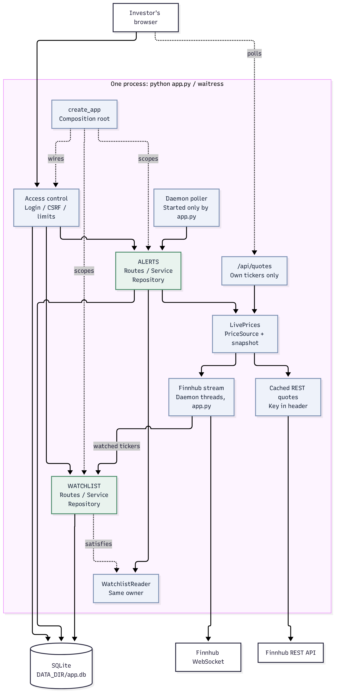
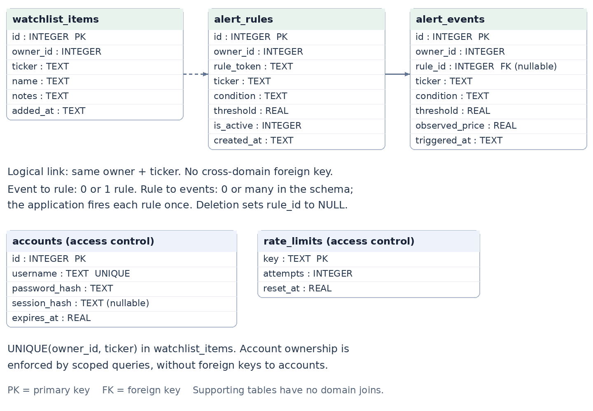

# Stock watchlist and price alerts

Assignment 1 | Issam Arida | Revised 3 October 2026

## 1. Audience, scope and development process

The intended users are independent retail investors who follow a small set of US stocks, usually around a job or studies. They use a browser on a desktop or phone to record what they follow, set a price condition and later review which conditions were met. The stakeholder is the investor, not GitHub or a cloud provider. The app is a monitoring aid, not a brokerage or an investment recommendation service.

The two business domains are watchlist and alerts. Watchlist owns tickers, names and notes. Alerts owns above/below threshold rules and their trigger history. Both read and write SQLite. Separate private accounts are needed because users should not see or change each other's notes or rules. Login is supporting access control around these two domains. The initial setting is a local course demonstration or a small controlled pilot; there is no public Assignment 1 deployment.

### SDLC choice and SMART goals

I used iterative and incremental development: scaffold, watchlist, alerts, adapters, testing and documentation, followed by a scope and usability review. Small slices gave me working behaviour before the whole design was settled. Waterfall would make a late domain-separation change costly; a full Scrum process would add team ceremonies to an individual project.

- Complete SQLite-backed behaviour in both domains by 1 October. The original two domains were in place on 30 September.
- Reach at least 70% measured core-logic coverage by 1 October. The initial suite reached 100% on its defined scope.
- Verify a fresh start with `python app.py` and an empty DATA_DIR within five seconds by 2 October. The contract test exercises that path.
- Record five ADRs across at least three actual commit dates by 2 October. Entries were introduced on 28 September, 30 September and 1 October.
- Review audience, ownership, error cases and responsive layouts on 3 October, then run the complete test suite before integration.

### What happened in practice

The repository began on 23 September, but most implementation started on 28 September. That gap compressed the work. Three early implementation commits landed minutes apart. On 29 September I simplified the package to app/ before adding alerts. Ten commits landed on 30 September, followed by testing and reporting on 1 October and visual changes on 2 October. This was incremental delivery, but unevenly paced.

The 3 October review exposed a limitation in the original single-user assumption, a stale-rule race and unfinished process evidence. It added private ownership and login, fixed the race, improved the interface and expanded tests. These changes are dated revisions in the existing five ADRs, not backdated new decisions. The intended integration flow is feature branches into develop, then a tested release into main. Local commit dates alone cannot establish the remote push cadence required by the brief.

<!-- pagebreak -->

## 2. Architecture and the modularisation seam

Figure 1. One process, two business domains. Solid arrows show request/data flow; dotted arrows show wiring or structural interface conformance. Access control and price adapters are supporting components.

The only start command is `python app.py`. It loads environment configuration, calls create_app, starts the Finnhub stream and a daemon poller, and runs waitress. Flask debug mode and its reloader are off. create_app is the only module importing multiple business/adaptor areas, and never starts a background thread. The poller and the two stream threads run within the same process; they are not a second service or job runner.

Each domain has routes, a service and a repository. Routes handle forms; services validate and apply business rules; repositories execute parameterised SQL using one short-lived connection per call. The composition root builds both repositories with the authenticated owner ID, so a request cannot choose another owner's data. Authentication code does not import either business domain.

Alerts calls the neutral WatchlistReader and PriceSource protocols in app/ports.py. It never imports watchlist or market. A scoped WatchlistService satisfies WatchlistReader structurally. The shared price source, LivePrices, combines two Finnhub feeds. One server-side WebSocket connection streams trades for every watched ticker; a cached REST adapter supplies the quote and previous close when no trade arrived in the last minute. Finnhub is the only price source and no price is ever made up. The REST adapter sends the key in a header. The WebSocket needs it in the connection URL, which is never logged, and a log filter masks it as a second safeguard. Invalid quotes become PriceUnavailable.

To split alerts in Assignment 2, its tables and poller could move together, and WatchlistReader could become an authenticated HTTP client carrying the same owner identity. That would require an identity propagation contract, an endpoint and network-failure handling. The current logical seam reduces coupling; it does not make those distributed-system concerns disappear.

Jinja templates, local CSS and one small inline script provide a responsive interface without a frontend build system or external assets. The script polls the same-origin, session-protected /api/quotes endpoint every two seconds and updates prices, the day change and each rule's distance to its threshold. The browser never contacts Finnhub or sees the key; the Content Security Policy restricts scripts to the page nonce and fetch requests to the app itself. I chose polling over pushing to the browser because each open stream would hold one of waitress's few worker threads. Summary counts are real database values. Empty states guide the next action, and dormant rules are visibly different from active and fired rules.

<!-- pagebreak -->

## 3. SQLite model and consistency

Figure 2. All five tables in DATA_DIR/app.db. The dashed watchlist relationship is logical, not a foreign key. An alert event's rule reference may be NULL. Accounts and rate_limits are access-control storage, not additional business domains.

Watchlist ticker uniqueness is composite: UNIQUE(owner_id, ticker). Domain owner IDs are plain integers with no account foreign key or cross-domain join. Fields other than alert_events.rule_id and accounts.session_hash are populated and non-null in normal writes; integer primary keys identify rows. Notes default to an empty string. Domain owner IDs default to reserved owner 0 for legacy data. Accounts use unique usernames.

alert_rules constrains condition to above/below and threshold to a positive number. The service also rejects non-finite thresholds and quotes. is_active starts at 1. fire_rule takes a SQLite write lock, checks owner, active status and the random rule_token, then deactivates the rule and inserts its event in one transaction. Rollback preserves the active rule if the insert fails. The token prevents an evaluation of a deleted rule from acting on a replacement with a reused numeric ID.

Events copy the ticker, condition, threshold, observed price and UTC time. Deleting a rule uses ON DELETE SET NULL, keeping its history readable. The schema permits multiple referenced events; the one-shot transaction enforces at most one firing through the application. Removing a watched ticker leaves its rules dormant; adding it back resumes them.

Startup creates missing tables and transactionally upgrades the previous shared schema. Old rows and links are preserved under owner 0, which has no account and is not polled. New registrants cannot claim them. This preserves privacy without requiring a manual startup migration. SQLite stays in its default journal mode.

<!-- pagebreak -->

## 4. Safety, edge cases and verification

Passwords use salted scrypt hashes. Account names are normalised; passwords are 15–128 characters and are never stored as plaintext. Login replaces a random session token, while SQLite stores only its digest and absolute expiry. The signed cookie is HttpOnly and SameSite=Lax. Logout revokes the token, and a subsequent login invalidates the previous session. Every POST requires a session-bound CSRF token. Templates escape user content, and security headers restrict scripts, framing and caching.

SQLite rate-limit reservations are atomic and persist across restarts. Defaults allow five login attempts per username and 25 per source IP in 15 minutes, plus five registrations per IP. An authenticated account has 60 writes per minute and four manual evaluations per minute. Blocked requests return 429 with Retry-After. Forwarding headers are not trusted, preventing a client from supplying a different rate-limit identity.

The operating envelope is intentionally small: up to 50 accounts, 30 assets per account and 100 retained rules per account by default. These limits are configurable and are not a concurrency benchmark. Streamed trades cost no REST requests, so during market hours the shared 30-request rolling minute budget and 30-second cache mainly cover new tickers, previous closes and closed markets. Up to 50 tickers stream at once, the free Finnhub limit. Alerts are checked every 15 seconds by default, so a crossing trade fires a rule within one interval; fired alerts appear in the app, not as push notifications.

### Verified scenarios

- Independent users can follow the same ticker, but cannot read, delete or trigger each other's records. Forged owner fields do not change request scope.
- Equality does not trigger. Missing, boolean, non-finite or non-positive prices are skipped. Dormant rules resume only when their own owner's ticker returns.
- Simultaneous evaluations create one event. Deletion and ID reuse cannot fire a replacement. Event insertion failure rolls back deactivation.
- Password hashes, generic login errors, CSRF rejection, expiry, logout revocation, repeat-login invalidation and persistent/concurrent throttling are tested.
- Old database rows survive two startup upgrades. Storage quotas, quote budgets and the latest-100-event display are exercised. Full history remains stored.

The command is `pytest --cov=app --cov-report=term-missing`. On 3 October, 221 tests passed with 100% statement coverage over 771 measured statements. The WebSocket is faked in tests: subscribe and unsubscribe diffs, malformed messages, reconnect backoff and key redaction are covered. Coverage includes access control and excludes only domain routes and the composition root. Tests mock public API calls and use temporary SQLite files. A contract test launches the actual waitress entry point and checks readiness within five seconds. Browser verification exercised registration, login, asset creation and alert firing at 1440, 1024, 768 and 390 pixels with no page errors or page-wide overflow.

Known limits remain: automated tests never touch the network, so real Finnhub compatibility rests on a manual check (the stream reached Finnhub and handled a rejected key) and on a local server speaking Finnhub's protocol; there is no MFA or password recovery; the UI shows the latest 100 events without a history export tool. Code coverage cannot establish complete security or every possible race. HTTPS, secure cookies and deployment access controls are prerequisites for any later public use.

<!-- pagebreak -->

## 5. Deployment contract, evidence and disclosure

The application meets the Assignment 1 runtime shape: one process started by python app.py, HOST defaulting to 0.0.0.0, PORT defaulting to 8080, no interactive server setup, one configurable SQLite path, and no required external service at startup; prices need a Finnhub key. requirements.txt is the sole manifest, with seven direct dependencies. There is no Dockerfile, Compose configuration, authored CI workflow, IaC or public deployment.

Configuration uses optional environment variables, including polling, caching, authentication limits and storage capacities. The app does not require a .env file. The public /health endpoint reads the three business tables and two access-control tables, returning a generic 503 if a read fails. Logs go to stdout. Readiness is tested from a previously nonexistent data directory.

For Assignment 2, a persistent DATA_DIR volume prevents losing data with the container. Run one replica, use HTTPS, set SESSION_COOKIE_SECURE=true and supply a strong stable SECRET_KEY as a runtime secret. Without an explicit signing secret, a random startup default keeps local setup simple but requires users to sign in after restart. A future reverse proxy needs explicit trusted-proxy configuration; otherwise IP throttling may group users at the proxy address. No deployment is performed in this assignment.

### Assessment evidence still owned by the author

The original history contains generic commit messages that the brief excludes from meaningful cadence. Before this revision there were 25 local commits over six dates, with ten on 30 September; excluding clearly generic messages left fewer qualifying days. New branches do not repair earlier push timestamps. Remote push evidence must be assessed independently, and history must not be fabricated or backdated.

Exactly five ADR entries remain, introduced across three real commit dates. Today's revisions record the new private-account scope. ADR-2 also records that its displayed date was changed in a later historical commit; the repository does not treat that edit as evidence of an earlier commit. The report and diagrams describe the current code rather than the original shared-workspace design.

AI_USAGE.md still contains seven unfinished personal-explanation cells. They must be completed by the author after reading and understanding the code. The final review also needs accurate disclosure in the detailed log before submission; that file has not been changed during this review. Professor approval of the use case and attendance at the closed-book comprehension check cannot be established from source code. The check multiplies the technical subtotal, so a working application alone cannot guarantee 100/100.

### AI disclosure

I acknowledge the use of Claude and Claude Code to plan and generate the initial application, tests and documentation, and Codex to review the brief, implement the private-account revision, expand safety tests, redesign the interface and revise the report and diagrams. The prompts used include building separate watchlist and alerts domains, checking the submission against the assignment, improving the frontend and login within one process and two domains, and replacing simulated prices with live Finnhub data streamed over a server-side WebSocket. The output of these prompts was used to create and revise the implementation and its supporting material. The personal comprehension explanations remain the author's responsibility.

### Technical references

- Flask, Security Considerations: https://flask.palletsprojects.com/en/stable/web-security/
- Werkzeug, Security Helpers: https://werkzeug.palletsprojects.com/en/stable/utils/#module-werkzeug.security
- OWASP, Authentication Cheat Sheet: https://cheatsheetseries.owasp.org/cheatsheets/Authentication_Cheat_Sheet.html
- Finnhub, WebSocket Trades and Quote API: https://finnhub.io/docs/api/websocket-trades

These references informed the access-control review and the price feed; they are not a security certification of this application.
